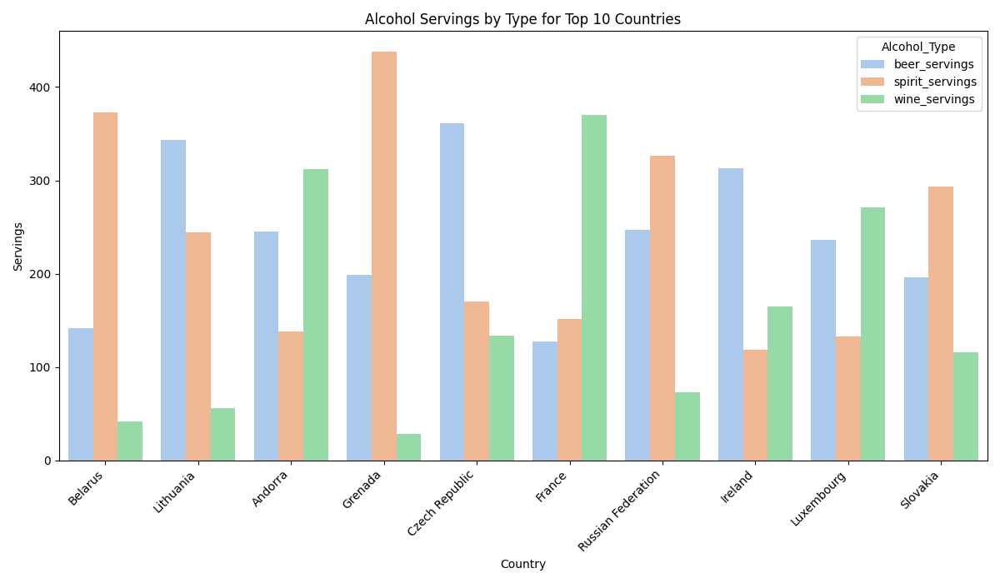
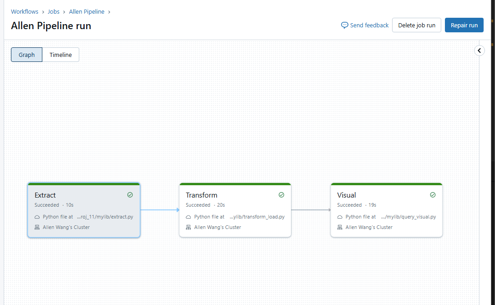

# Allen_Wang_miniproj_11

[](https://github.com/nogibjj/Allen_Wang_miniproj_11/actions/workflows/CICD.yml)

## Overview

This project demonstrates a complete data pipeline using Databricks, showcasing how to extract data from an external url, transform it with SQL and Python, and load it into a structured format for analysis. The project includes a CI/CD setup for ensuring code quality, reproducibility, and testing. The pipeline identifies trends in alcohol consumption and drug use across different countries and age groups, with a focus on actionable insights from complex SQL queries.

## Pipeline Overview

### Data Pipeline Components:
- **Data Source**: [`drinks`](https://raw.githubusercontent.com/fivethirtyeight/data/master/alcohol-consumption/drinks.csv) and [`drug use`](https://raw.githubusercontent.com/fivethirtyeight/data/master/drug-use-by-age/drug-use-by-age.csv) tables.
- **Data Sink**: Transformed data is stored in Delta tables on Databricks.
- **Transformation**: Fill in na and new features created
- **Visualization**: Analysis results are visualized using Python's Matplotlib and Seaborn.

### Pipeline Steps:
1. Extract data from url.
2. Load data into a Databricks Delta table.
3. Apply ransformations for data aggregation and filtering.
4. Visualize the results and save plots.

---

## Project Structure

- **`mylib/`**: Python scripts for SQL queries, data extraction, and transformations.
- **`.devcontainer/`**: Configuration for the development container.
- **Makefile**: Provides commands for setup, formatting, linting, testing, and running SQL queries:
  - `make install`: Installs dependencies.
  - `make format`: Formats Python files.
  - `make lint`: Lints Python files.
  - `make test`: Runs unit tests.
  - `make all`: Runs all tasks (install, format, lint, and test).
- **`.github/workflows/CICD.yml`**: CI/CD pipeline configuration using GitHub Actions.
- **`README.md`**: Setup instructions, usage guidelines, and project description.


## Setup

1. **Clone the repository**:

    ```bash
    git clone https://github.com/nogibjj/Allen_Wang_miniproj_11.git
    cd Allen_Wang_miniproj_11
    ```

2. **Install dependencies**:

    ```bash
    make install
    ```

3. **Format code**:

    ```bash
    make format
    ```

4. **Lint code**:

    ```bash
    make lint
    ```

5. **Test code**:

    ```bash
    make test
    ```

## Visualization from Query




## Databricks Pipeline

