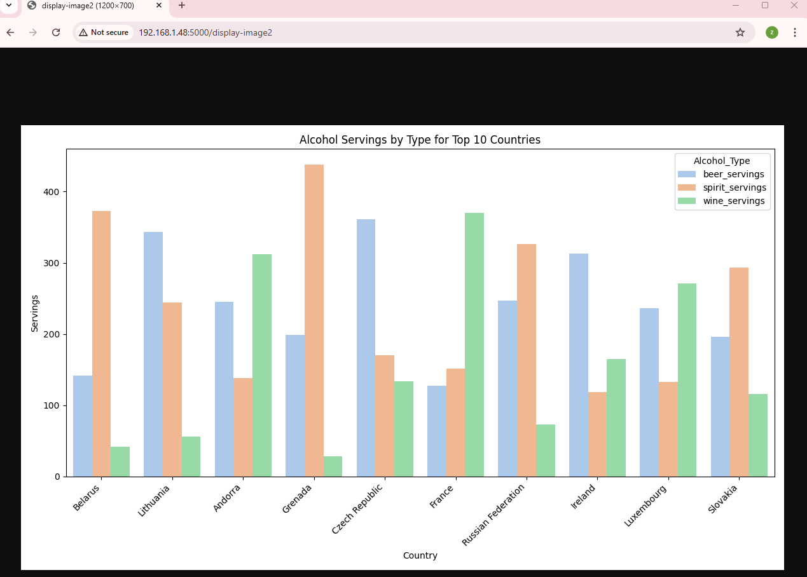
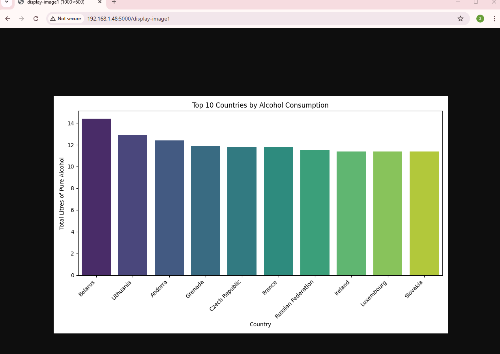
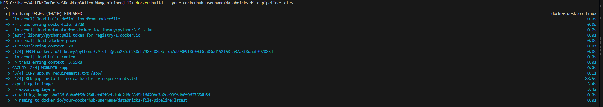
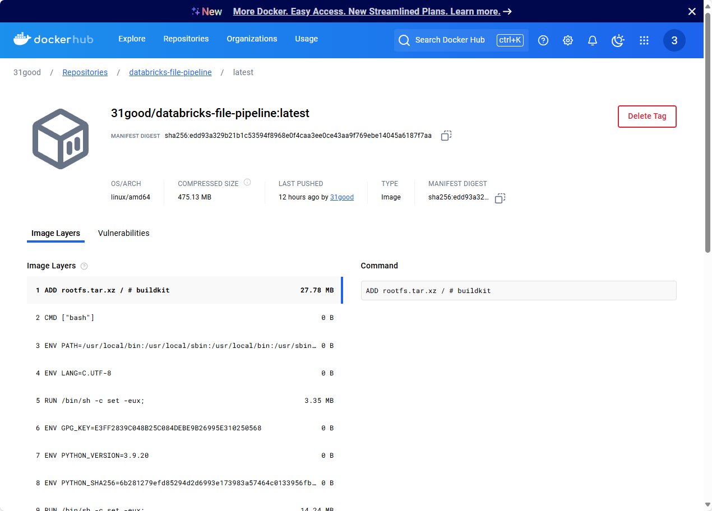

# Allen_Wang_miniproj_12

[](https://github.com/nogibjj/Allen_Wang_miniproj_12/actions/workflows/CICD.yml)

## Overview

This project demonstrates a simple Python application containerized with Docker. The application includes two primary functionalities:
1. Checking file status on Databricks.
2. Displaying a pre-generated image from a specified path.

Additionally, the project includes a CI/CD pipeline configured using GitHub Actions to:
- Build the Docker image.
- Push the Docker image to Docker Hub.

This showcases both local application execution in a Docker container and an automated deployment pipeline.


## Pipeline Overview

### Features:
1. **Data Source**: Demonstrates functionality with example data files and APIs.
2. **CI/CD Pipeline**: Automates testing, linting, building, and Docker image deployment to Docker Hub.
3. **Application**: Provides APIs for file checking and image display.

### Application Endpoints:
- **`GET /check-file`**: Checks the status of a file on Databricks.
  - Example query: `http://127.0.0.1:5000/check-file?file_path=/path/to/file`
- **`GET /display-image`**: Displays an image stored locally or in a specific workspace.
  - Example query: `http://127.0.0.1:5000/display-image1` `http://127.0.0.1:5000/display-image2`

### Pipeline Steps:
1. Extract data from url.
2. Load data into a Databricks Delta table.
3. Apply ransformations for data aggregation and filtering.
4. Visualize the results and save plots.

---

## Project Structure

- **`mylib/`**: Python scripts for functionality (e.g., querying Databricks, loading images).
- **`Dockerfile`**: Instructions for containerizing the application.
- **`Makefile`**: Commands for setup, testing, and Docker operations:
  - `make install`: Installs dependencies.
  - `make format`: Formats Python files.
  - `make lint`: Lints Python files.
  - `make test`: Runs unit tests.
  - `make build`: Builds the Docker image locally.
  - `make run`: Runs the Docker container locally.
  - `make push`: Tags and pushes the Docker image to Docker Hub.
- **`.github/workflows/CICD.yml`**: GitHub Actions configuration for CI/CD.
- **`README.md`**: Setup instructions, usage guidelines, and project description.

## Setup

1. **Clone the repository**:

    ```bash
    git clone https://github.com/nogibjj/Allen_Wang_miniproj_12.git
    cd Allen_Wang_miniproj_12
    ```

2. **Install dependencies**:
    ```bash
    make install
    ```

3. **Run the application**:
    ```bash
    python app.py
    ```

4. **Access the application**:
   - Visit `http://127.0.0.1:5000/` for the homepage.
   - Use the described endpoints for additional functionalities.


### Dockerized Setup

1. **Build the Docker image**:
    ```bash
    docker build -t 31good/databricks-file-pipeline:latest .
    ```

2. **Run the Docker container**:
    ```bash
    docker run -p 5000:5000 31good/databricks-file-pipeline:latest
    ```

3. **Access the application**:
   - Visit `http://127.0.0.1:5000/`.

## Usage Instructions

### File Status Check
Send a GET request to check the file status:
```bash
curl "http://127.0.0.1:5000/check-file?file_path=/path/to/file"
```

### Image Display
Access the image display endpoint:
```bash
curl "http://127.0.0.1:5000/display-image"
```

## Visualization Examples

### Alcohol Consumption by Type


### Top 10 countries alcohol consumption


---

## Docker Hub Repository

The Docker image is hosted at:
[31good/databricks-file-pipeline](https://hub.docker.com/r/31good/databricks-file-pipeline)

To pull the image:
```bash
docker pull 31good/databricks-file-pipeline:latest
```


